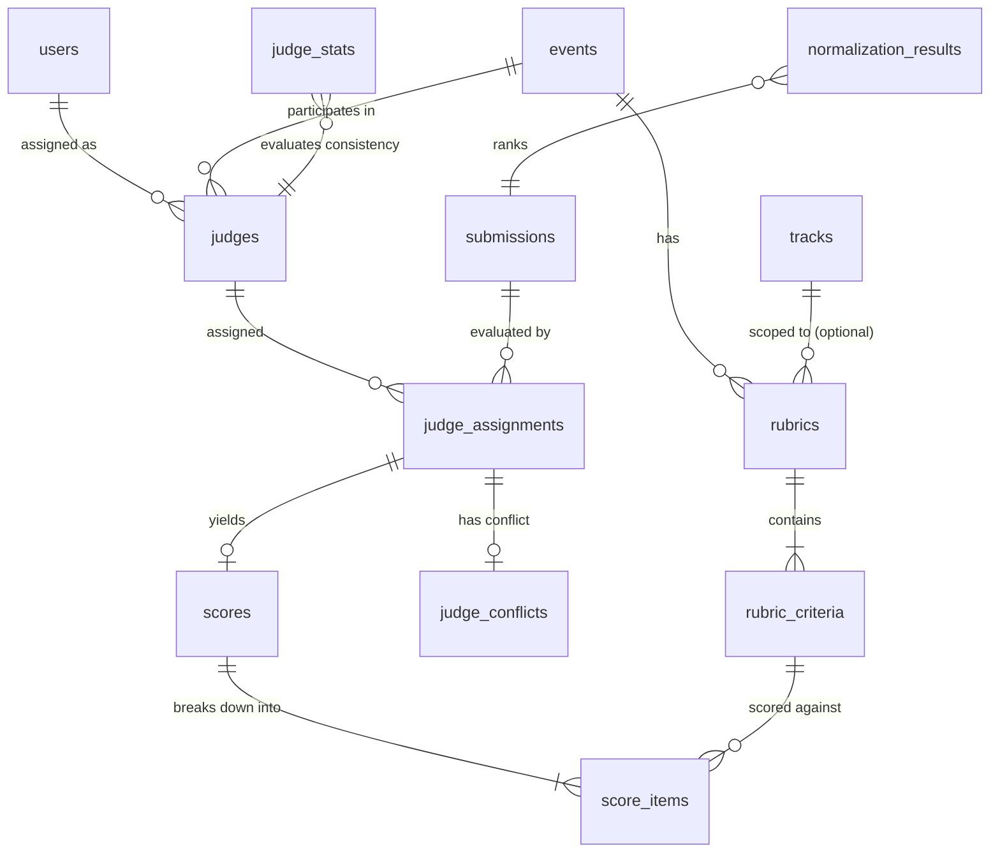

# Member 2 Judging System — Integration & Handoff Contract

**Author:** Member 2 (Judging Subsystem Lead)  
**Project:** Dogfood 2026 Hackathon OS  
**Status:** COMPLETE & AUDITED  
**Test Suite:** 111 passed / 0 failed / 0 skipped  
**TypeScript Verification:** 0 errors (`npx tsc --noEmit`)  
**Network Dependency:** Zero external network runtime dependencies (100% Offline-Capable)

---

## 1. Executive Summary & Purpose

This document serves as the formal architectural, database, security, and API integration contract between **Member 2** (Judging System) and **Member 1** (Core Platform, Auth, Events, Tracks, and Submissions).

Member 2 has delivered a complete, offline-first judging engine encompassing:
1. Complete relational schema for judging, rubrics, scoring, conflicts, and normalization statistics.
2. Zod validation schemas enforcing strict bounds, positive weights, and completeness rules.
3. Transactional core judging service with row-level security (RLS), score immutability, and blind-judging boundaries.
4. Statistical Z-Score normalization and deterministic ranking engine.
5. Express HTTP REST API with Role-Based Access Control (RBAC) and standardized response wrappers.
6. Zero external network dependencies, operating purely on local SQLite via `better-sqlite3` and `drizzle-orm`.

Member 1 must review this contract to ensure smooth integration when implementing the production authentication system, event lifecycle, track management, and submission workflows.

---

## 2. Authentication Contract

### Interface Expectation

All judging operations rely on the standard Express `Request` object populated with the authenticated user context. Member 2 expects:

```typescript
export interface AuthenticatedUser {
  id: string;      // Unique user identifier matching users.id
  email: string;   // User email address
  role: 'participant' | 'judge' | 'organizer' | 'admin' | string;
}

declare global {
  namespace Express {
    interface Request {
      user?: AuthenticatedUser;
    }
  }
}
```

Every secured judging route executes `authenticate` before reaching controllers or services:
- `req.user.id`: Must contain the canonical user ID (UUID string matching `users.id`).
- `req.user.email`: Must contain the user's primary email.
- `req.user.role`: Must be one of the recognized role strings (`participant`, `judge`, `organizer`, `admin`).

### How Member 1's Authentication Must Populate These Fields

When Member 1 implements the production authentication system (e.g., signed JWTs, secure session cookies, or local token lookups):
1. Extract the token/session identifier from the incoming request (e.g., `Authorization: Bearer <token>` or session cookie).
2. Validate the token/session against the local SQLite database or cryptographic signature.
3. Look up the corresponding record in the `users` table.
4. Populate `req.user = { id: user.id, email: user.email, role: user.role }`.
5. Call `next()` to hand off control to downstream handlers.

### Replacing `server/src/middleware/auth.ts`

Member 1 is authorized to replace or upgrade the internal token extraction and validation logic in:
- `server/src/middleware/auth.ts`

**CRITICAL REQUIREMENT:** Member 1 **MUST PRESERVE** the `req.user` interface and the `requireRole(allowedRoles: string[])` guard signature. Member 2's routes and controllers depend directly on `req.user.id` and `req.user.role`.

---

## 3. Role-Based Access Control (RBAC) Contract

### Supported Roles

| Role | Description |
| :--- | :--- |
| `participant` | Hackathon competitor submitting projects. Strictly prohibited from accessing judging assignments, scoring, conflicts, or normalization runs. Allowed to view finalized/published anonymized results. |
| `judge` | Assigned evaluator. Can view own assignments, inspect rubrics, submit draft scores, finalize scores, and report conflicts of interest. Blind judging prevents seeing other judges' evaluations or scores. |
| `organizer` | Event director. Can trigger Z-score normalization runs, inspect full normalization runs (including judge variance stats), and configure evaluations. |
| `admin` | System administrator with full privileges across all judging operations. |

### Access Control Matrix

| Endpoint | Method | Allowed Roles | Access Rules & Enforcement |
| :--- | :--- | :--- | :--- |
| `/v1/judging/assignments` | `GET` | `judge`, `admin` | Scoped strictly to assignments owned by the calling judge (`req.user.id`). |
| `/v1/judging/assignments/:assignmentId` | `GET` | `judge`, `admin` | Requires ownership verification. Non-owners receive `403 Forbidden`. |
| `/v1/judging/assignments/:assignmentId/conflict` | `POST` | `judge`, `admin` | Requires ownership verification. Converts assignment to `conflict` status. |
| `/v1/judging/assignments/:assignmentId/score` | `PUT`, `POST` | `judge`, `admin` | Requires ownership verification. Finalized scores are locked immutably. |
| `/v1/judging/results` | `GET` | All authenticated (`participant`, `judge`, `organizer`, `admin`) | Returns normalized rankings; excludes private individual judge score items. |
| `/v1/judging/normalize` | `POST` | `organizer`, `admin` | Triggers Z-score calculation and persists run artifacts. |
| `/v1/judging/normalization/:runId` | `GET` | `organizer`, `admin` | Returns statistical metrics (`mean`, `stdDev`, `sampleCount`) and rankings. |

---

## 4. Database Integration Contract

### Dependency Overview

The judging system integrates with the shared database schema via `server/src/db/schema.ts` and `server/src/db/judging.schema.ts`.



### Table Ownership Breakdown

#### A. Implemented by Member 2 (Complete & Verified)

1. **`judges`**:
   - `id` (TEXT, PK, UUID)
   - `event_id` (TEXT, NOT NULL, indexed) — logical reference to `events.id`
   - `user_id` (TEXT, NOT NULL, FK -> `users.id` ON DELETE CASCADE)
   - `status` (TEXT: `'active' | 'inactive'`, default `'active'`)
   - `created_at` (TEXT, timestamp)
   - *Constraint:* Unique on `(event_id, user_id)`

2. **`rubrics`**:
   - `id` (TEXT, PK, UUID)
   - `event_id` (TEXT, NOT NULL, indexed) — logical reference to `events.id`
   - `track_id` (TEXT, NULLABLE, indexed) — logical reference to `tracks.id` (null = event-wide)
   - `name` (TEXT, NOT NULL)
   - `description` (TEXT, NULLABLE)
   - `created_at` (TEXT, timestamp)

3. **`rubric_criteria`**:
   - `id` (TEXT, PK, UUID)
   - `rubric_id` (TEXT, NOT NULL, FK -> `rubrics.id` ON DELETE CASCADE)
   - `name` (TEXT, NOT NULL)
   - `description` (TEXT, NULLABLE)
   - `weight` (REAL, NOT NULL, default 1.0, CHECK `weight > 0`)
   - `max_score` (INTEGER, NOT NULL, default 10, CHECK `max_score > 0`)
   - `sort_order` (INTEGER, NOT NULL, default 0)

4. **`judge_assignments`**:
   - `id` (TEXT, PK, UUID)
   - `judge_id` (TEXT, NOT NULL, FK -> `judges.id` ON DELETE CASCADE)
   - `submission_id` (TEXT, NOT NULL, indexed) — logical reference to `submissions.id`
   - `status` (TEXT: `'pending' | 'scored' | 'conflict'`, default `'pending'`)
   - `assigned_at` (TEXT, timestamp)
   - *Constraint:* Unique on `(judge_id, submission_id)`

5. **`judge_conflicts`**:
   - `id` (TEXT, PK, UUID)
   - `assignment_id` (TEXT, NOT NULL, FK -> `judge_assignments.id` ON DELETE CASCADE)
   - `judge_id` (TEXT, NOT NULL, FK -> `judges.id` ON DELETE CASCADE)
   - `submission_id` (TEXT, NOT NULL, indexed)
   - `reason` (TEXT, NOT NULL)
   - `status` (TEXT: `'reported' | 'resolved'`, default `'reported'`)
   - `reported_at` (TEXT, timestamp)
   - `resolved_at` (TEXT, NULLABLE)

6. **`scores`**:
   - `id` (TEXT, PK, UUID)
   - `assignment_id` (TEXT, NOT NULL, UNIQUE, FK -> `judge_assignments.id` ON DELETE CASCADE)
   - `total_raw_score` (REAL, NOT NULL)
   - `total_normalized_score` (REAL, NULLABLE)
   - `is_final` (INTEGER/BOOLEAN, NOT NULL, default false)
   - `submitted_at` (TEXT, timestamp)

7. **`score_items`**:
   - `id` (TEXT, PK, UUID)
   - `score_id` (TEXT, NOT NULL, FK -> `scores.id` ON DELETE CASCADE)
   - `criterion_id` (TEXT, NOT NULL, FK -> `rubric_criteria.id` ON DELETE CASCADE)
   - `value` (REAL, NOT NULL, CHECK `value >= 0`)
   - `feedback` (TEXT, NULLABLE)
   - *Constraint:* Unique on `(score_id, criterion_id)`

8. **`judge_stats`**:
   - `id` (TEXT, PK, UUID)
   - `run_id` (TEXT, NOT NULL, indexed)
   - `judge_id` (TEXT, NOT NULL, FK -> `judges.id` ON DELETE CASCADE)
   - `mean_score` (REAL, NOT NULL)
   - `std_dev` (REAL, NOT NULL)
   - `sample_count` (INTEGER, NOT NULL)
   - `calculated_at` (TEXT, timestamp)
   - *Constraint:* Unique on `(run_id, judge_id)`

9. **`normalization_results`**:
   - `id` (TEXT, PK, UUID)
   - `run_id` (TEXT, NOT NULL, indexed)
   - `submission_id` (TEXT, NOT NULL, indexed)
   - `track_id` (TEXT, NULLABLE, indexed)
   - `aggregate_z_score` (REAL, NOT NULL)
   - `final_normalized_score` (REAL, NOT NULL)
   - `raw_score_average` (REAL, NOT NULL)
   - `rank` (INTEGER, NOT NULL)
   - `calculated_at` (TEXT, timestamp)
   - *Constraint:* Unique on `(run_id, submission_id)`

#### B. Tables Expected from Member 1

Member 2 has designed the judging schema with logical foreign keys so that Member 1 can implement the remaining platform entities without migrations failing:

1. **`events`**:
   - Expected columns: `id` (TEXT, PK), `name`, `status`, etc.
   - Referenced by: `judges.event_id`, `rubrics.event_id`.
2. **`tracks`**:
   - Expected columns: `id` (TEXT, PK), `event_id`, `name`, etc.
   - Referenced by: `rubrics.track_id`, `normalization_results.track_id`.
3. **`submissions`**:
   - Expected columns: `id` (TEXT, PK), `event_id`, `track_id`, `status`, etc.
   - Referenced by: `judge_assignments.submission_id`, `judge_conflicts.submission_id`, `normalization_results.submission_id`.
4. **`users`** *(Already in `schema.ts` foundation)*:
   - Primary key `id` (TEXT), referenced by `judges.user_id`.
5. **`audit_logs`** *(Already in `schema.ts` foundation)*:
   - Primary key `id` (TEXT), populated by Member 2 judging audit logger (`SCORE_DRAFT_SAVED`, `SCORE_FINALIZED`, `JUDGE_CONFLICT_REPORTED`).

---

## 5. Submission Status Contract

### Transition Rule

When all non-conflicted judge assignments for a given submission are finalized (`is_final = true` and `status = 'scored'`), the submission's lifecycle status must transition to:

```text
status = 'judged'
```

### Existing Member 2 Implementation Behavior

In `server/src/modules/judging/judging.service.ts`, Member 2 provides the helper:

```typescript
export function checkAndUpdateSubmissionJudgedStatus(submissionId: string, tx: any = db)
```

1. Queries all assignments for `submissionId` where `status != 'conflict'`.
2. If `assignments.length > 0` and every assignment has `status === 'scored'`:
   - Checks if the `submissions` table exists in SQLite (`sqlite_master`).
   - If present, executes:
     ```sql
     UPDATE submissions SET status = 'judged' WHERE id = ?
     ```
   - If the `submissions` table does not yet exist, it catches the condition gracefully without throwing an unhandled error.
3. Member 1 must ensure that when the `submissions` table is created, its schema includes a `status` text column compatible with the `'judged'` value.

---

## 6. Authentication Production Replacement Guide

### Security Notice: Test-Only Role Mocking

In `server/src/middleware/auth.ts`, lines 53–55:

```typescript
} else if (env.NODE_ENV === 'test' && xUserRole) {
  userRecord = { id: tokenOrId, email: `${tokenOrId}@local`, role: xUserRole };
}
```

> [!CAUTION]
> The `x-user-role` header is strictly gated by `env.NODE_ENV === 'test'`. In production or development mode (`NODE_ENV !== 'test'`), incoming client headers must NEVER be trusted to assign user roles.

### What Member 1 Must Preserve When Replacing Authentication

When replacing the mock/temporary token logic:
1. Verify credentials (password hash, JWT signature, or session store).
2. Fetch the true role from the database record (`users.role`).
3. Preserve the exact signature of:
   - `authenticate(req: Request, res: Response, next: NextFunction)`
   - `requireRole(allowedRoles: string[])`
4. Guarantee that `req.user` contains `{ id, email, role }`.

---

## 7. API Contract

All endpoints are registered under both `/v1/judging` and `/api/v1/judging` (with aliases `/judging` and `/api/judging`).

```text
Base URL Prefixes:
  /v1/judging
  /api/v1/judging
```

### Endpoint Specifications

#### 1. `GET /v1/judging/assignments`
- **Required Role:** `judge`, `admin`
- **Query Parameters:** `eventId` (optional string)
- **Request Body:** None
- **Purpose:** Retrieves all active judging assignments assigned to the calling judge.
- **Authorization Behavior:** Only returns assignments belonging to `req.user.id`. Blind judging ensures judges cannot see evaluations belonging to others.

#### 2. `GET /v1/judging/assignments/:assignmentId`
- **Required Role:** `judge`, `admin`
- **Params:** `assignmentId` (UUID)
- **Request Body:** None
- **Purpose:** Retrieves full assignment details, including the assigned submission ID, applicable rubric, all scoring criteria (weights, max scores), and any draft or finalized scores previously submitted by this judge.
- **Authorization Behavior:** Strictly verifies that the calling judge owns the assignment. Returns `403 Forbidden` if another judge attempts access.

#### 3. `POST /v1/judging/assignments/:assignmentId/conflict`
- **Required Role:** `judge`, `admin`
- **Params:** `assignmentId` (UUID)
- **Request Body:**
  ```json
  {
    "reason": "Personal acquaintance with team member"
  }
  ```
- **Purpose:** Reports a conflict of interest on an un-scored assignment.
- **Authorization Behavior:** Verifies ownership. Marks assignment `status = 'conflict'`, creates a `judge_conflicts` record, and logs an audit trail. Returns `400 BadRequestError` if the assignment was already scored.

#### 4. `PUT /v1/judging/assignments/:assignmentId/score` (and `POST`)
- **Required Role:** `judge`, `admin`
- **Params:** `assignmentId` (UUID)
- **Request Body:**
  ```json
  {
    "items": [
      {
        "criterionId": "criterion-uuid-1",
        "value": 8.5,
        "feedback": "Great implementation and UI finish"
      },
      {
        "criterionId": "criterion-uuid-2",
        "value": 9.0,
        "feedback": "Solid architecture"
      }
    ],
    "isFinal": true
  }
  ```
- **Purpose:**
  - When `isFinal: false`: Saves a draft score. Can contain partial criteria.
  - When `isFinal: true`: Finalizes the evaluation. Requires **all** rubric criteria to be scored. Transitions assignment to `status = 'scored'`.
- **Authorization Behavior:** Verifies ownership. If the score was previously finalized, returns `403 Forbidden` (Immutability rule).

#### 5. `GET /v1/judging/results`
- **Required Role:** All authenticated users (`participant`, `judge`, `organizer`, `admin`)
- **Query Parameters:** `eventId` (optional), `trackId` (optional), `runId` (optional, defaults to latest)
- **Request Body:** None
- **Purpose:** Retrieves leaderboard rankings from the normalization results.
- **Response Format:** Returns ranked submissions with `rank`, `finalNormalizedScore`, `rawScoreAverage`, and `aggregateZScore`. Raw individual judge scores and feedback remain strictly protected.

#### 6. `POST /v1/judging/normalize`
- **Required Role:** `organizer`, `admin`
- **Request Body:**
  ```json
  {
    "eventId": "event-uuid",
    "trackId": "optional-track-uuid",
    "minJudgeSampleCount": 5
  }
  ```
- **Purpose:** Triggers the Z-score normalization and ranking algorithm.
- **Behavior:** Queries all finalized scores, computes judge mean and standard deviation, handles zero-variance judges, computes aggregate Z-scores, normalizes to a 0–100 scale, resolves ties deterministically, and persists results to `judge_stats` and `normalization_results`.

#### 7. `GET /v1/judging/normalization/:runId`
- **Required Role:** `organizer`, `admin`
- **Params:** `runId` (UUID)
- **Request Body:** None
- **Purpose:** Retrieves complete audit details of a normalization run, including each judge's sample count, mean, standard deviation, and full submission rankings.

---

## 8. Scoring Contract

### Mathematical Formula

The total raw score is computed strictly on the server:

$$\text{rawScore} = \sum_{i=1}^{k} \left(\text{value}_i \times \text{weight}_i\right)$$

### Validation & Business Rules

1. **Server Calculation:** The client submits criterion values ($x_i$); the server loads rubric criteria from the database, applies weights, and computes totals. Client-submitted totals are not accepted or trusted.
2. **Bounds Enforcement:** For each criterion, $0 \le \text{value}_i \le \text{maxScore}_i$. Values outside this range trigger `BadRequestError`.
3. **Immutability:** Once a score is submitted with `isFinal: true`, the evaluation is locked. Any subsequent update attempt by a judge returns `403 Forbidden`.
4. **Conflict Restriction:** Assignments with `status = 'conflict'` cannot be scored (`400 BadRequestError`).
5. **Finalization Completeness:** Draft submissions (`isFinal: false`) may contain partial criteria. Final submissions (`isFinal: true`) must score every criterion defined in the active rubric.

---

## 9. Normalization & Ranking Contract

The normalization engine standardizes scores across judges to eliminate scoring bias (e.g., overly harsh or generous judges).

### Exact Formulas

#### 1. Arithmetic Mean ($\mu$)
$$\mu = \frac{\sum_{i=1}^{n} x_i}{n}$$

#### 2. Sample Standard Deviation ($\sigma$)
$$\sigma = \sqrt{\frac{\sum_{i=1}^{n} (x_i - \mu)^2}{n - 1}} \quad \text{for } n > 1$$
*(If $n \le 1$, $\sigma = 0$)*

#### 3. Z-Score Transformation ($z$)
$$z = \frac{x - \mu}{\sigma}$$

#### 4. Zero Standard Deviation Fallback
If a judge awards identical scores to all evaluated projects ($\sigma = 0$):
$$z = 0$$
*(Neutral standard score; prevents division by zero).*

#### 5. Minimum Sample Count Threshold
Judges with fewer than `minJudgeSampleCount` evaluations (default: 5) are excluded from the Z-score calculation to avoid volatile statistics. Their evaluations are still retained for the raw score average.

#### 6. Multi-Judge Aggregation
$$\text{aggregateZ} = \text{mean}(z_1, z_2, \dots, z_m)$$

#### 7. Final Normalized Score (Scaled T-Score)
$$\text{finalNormalizedScore} = \text{clamp}\left(50 + 10 \times \text{aggregateZ}, \, 0, \, 100\right)$$
- $z = 0 \implies 50.0$
- $z = +1.0 \implies 60.0$
- $z = -1.0 \implies 40.0$

#### 8. Deterministic Ranking Order
Ties are resolved deterministically using a multi-tier hierarchy:
1. `final_normalized_score` **DESC** (Higher normalized performance ranks first)
2. `raw_score_average` **DESC** (Primary tie-breaker)
3. `submissionId` **ASC** (Deterministic alphabetical tie-breaker)

---

## 10. Offline-First Contract

Member 2 has been built and audited against strict offline constraints:

- **Local Database:** Pure SQLite stored in a local `.db` file using `better-sqlite3`.
- **Runtime Dependencies:** Node.js, Express, Drizzle ORM, Zod, and Pino.
- **Zero Cloud/Network Requirements:**
  - NO cloud database (DynamoDB, MongoDB Atlas, Cloud SQL)
  - NO external API calls (no OpenAI, Anthropic, or remote LLM calls)
  - NO hosted authentication (no Firebase, Supabase, Auth0, Clerk, or AWS Cognito)
  - NO remote telemetry or cloud font fetching at runtime
- The entire judging workflow operates 100% disconnected from the internet.

---

## 11. Final Verification Commands & Status

### Test & Compile Summary

Run the following commands in the `server` directory or repository root:

```bash
# 1. TypeScript compilation check
cd server
npx tsc --noEmit

# 2. Complete test suite execution
npm test
```

### Verified Results

```text
✓ tests/judging.schema.test.ts (45 tests)
✓ tests/normalization.service.test.ts (24 tests)
✓ tests/judging.service.test.ts (18 tests)
✓ tests/health.test.ts (2 tests)
✓ tests/judging.routes.test.ts (22 tests)

Test Files:  5 passed (5)
Tests:       111 passed (111)
Failures:    0
Skipped:     0
TypeScript:  0 errors
```

---

## 12. Integration Boundary & Ownership Policy

To maintain clear separation of responsibilities:

1. **Member 1 Ownership:**
   - User authentication and session management.
   - Event creation, configuration, and state machine.
   - Track configuration.
   - Team and project submission workflows.
2. **Member 2 Ownership:**
   - Judge assignments, conflicts, rubrics, and criteria.
   - Score capture, validation, and immutability.
   - Normalization, statistical aggregation, and ranking.
3. **Non-Modification Policy:**
   - Member 2 does not alter Member 1's architecture or tables.
   - If an integration problem occurs, it must be documented with file, problem, expected interface, and recommended minimal fix before taking action.
